# 🚀 LimitedCart - High-Scale E-Commerce Microservices

> **A production-grade, distributed e-commerce platform built to handle "Flash Sale" traffic spikes.**


LimitedCart is a reference architecture for building systems that survive "The Drop" — when thousands of users compete for limited inventory simultaneously. It moves away from fragile synchronous chains to robust, asynchronous workflows.

---

## 📖 Table of Contents
- [🚀 LimitedCart - High-Scale E-Commerce Microservices](#-limitedcart---high-scale-e-commerce-microservices)
  - [📖 Table of Contents](#-table-of-contents)
  - [1. System Architecture](#1-system-architecture)
  - [2. Service Catalog](#2-service-catalog)
  - [3. Key User Flows (Visualized)](#3-key-user-flows-visualized)
    - [Flow 1: User Authentication](#flow-1-user-authentication)
    - [Flow 2: Flash Sale (Order + Payment)](#flow-2-flash-sale-order--payment)
    - [Flow 3: Order Cancellation](#flow-3-order-cancellation)
    - [Flow 4: Admin - Add Product \& Restock](#flow-4-admin---add-product--restock)
    - [Flow 5: Product Search](#flow-5-product-search)
  - [4. Infrastructure \& Optimizations](#4-infrastructure--optimizations)
    - [Why these choices?](#why-these-choices)
  - [5. Getting Started (Local Docker)](#5-getting-started-local-docker)
  - [6. Kubernetes Deployment](#6-kubernetes-deployment)
    - [The Manager Script (`manage-k8s.py`)](#the-manager-script-manage-k8spy)

---

## 1. System Architecture

The core philosophy is **"Accept Fast, Process Later"**. The user-facing API accepts orders in milliseconds (HTTP 202) and queues them. A background worker (Temporal) manages the complex dance of locking stock and processing payments.

```mermaid
graph TD
    %% --- Actors ---
    User[📱 Flutter Web\n(Customer/Admin)]
    
    %% --- Gateway Layer ---
    subgraph "Infrastructure Layer"
        Ingress[🌐 Nginx Ingress Controller]
        Kafka[📨 Kafka Events]
        Redis[⚡ Redis Cache]
        TemporalServ[⏳ Temporal Server]
    end
    
    %% --- Service Layer ---
    subgraph "Core Microservices"
        Auth[🔐 Auth Service]
        Product[📦 Product Service]
        Inventory[📊 Inventory Service]
        Order[🛒 Order Service]
        Payment[💳 Payment Service]
        Notif[🔔 Notification Service]
    end
    
    %% --- Worker Layer ---
    Worker[⚙️ Temporal Worker\n(Saga Orchestrator)]

    %% --- Connections ---
    User -->|HTTPS/443| Ingress
    Ingress -->|/auth| Auth
    Ingress -->|/products| Product
    Ingress -->|/orders| Order
    Ingress -->|/inventory| Inventory
    
    %% Logic Flows
    Order --"1. Check Price"--> Redis
    Order --"2. Async Event"--> Kafka
    Kafka --"3. Consume"--> Worker
    Worker <--> TemporalServ
    
    %% Saga Steps
    Worker --"Step A: Lock Stock"--> Inventory
    Worker --"Step B: Status"--> Order
    Worker --"Step C: Wait Payment"--> Payment
    
    %% Feedback
    Order --"Progress Event"--> Kafka
    Kafka --> Notif
    Notif --"SSE Push"--> User
    
    %% Notifications
    Gateway -->|SSE| Notif
```

---

## 2. Service Catalog

| Service                | Resp.                                                                                                                  | Doc Link                                   |
| :--------------------- | :--------------------------------------------------------------------------------------------------------------------- | :----------------------------------------- |
| `common`               | **Shared Module**. Contains DTOs, Security Utils, and Exception Handlers shared by all services to ensure consistency. | -                                          |
| `auth-service`         | **Identity**. Issues JWTs. Manages RBAC.                                                                               | [README](./auth-service/README.md)         |
| `product-service`      | **Catalog**. Prices & Search Hybrid.                                                                                   | [README](./product-service/README.md)      |
| `order-service`        | **Ingestion**. Accepts orders (HTTP 202). State Machine.                                                               | [README](./order-service/README.md)        |
| `inventory-service`    | **Stock**. Optimistic Locking (`@Version`).                                                                            | [README](./inventory-service/README.md)    |
| `payment-service`      | **Finance**. Generates Payment Links. Mock Gateway.                                                                    | [README](./payment-service/README.md)      |
| `notification-service` | **Push**. Server-Sent Events (SSE) Stream.                                                                             | [README](./notification-service/README.md) |
| `temporal-worker`      | **Orchestrator**. Executes Sagas/Workflows.                                                                            | [README](./temporal-worker/README.md)      |
| `frontend-web`         | **UI**. Flutter Web App for all Personas.                                                                              | [README](./frontend-web/README.md)         |

---

## 3. Key User Flows (Visualized)

### Flow 1: User Authentication
*Standard secure identity management.*


### Flow 2: Flash Sale (Order + Payment)
*The flow is optimized for speed. Price checks and Stock reservation happen in Redis (ms latency), while heavy writes happen asynchronously.*

```mermaid
sequenceDiagram
    autonumber
    participant U as User (Flutter)
    participant O as Order Svc
    participant R as Redis
    participant DB as Postgres (Order)
    participant K as Kafka
    participant W as Temporal
    participant P as Payment Svc
    participant N as Notif Svc

    Note over U,N: 1. Async Placement (Gatekeeper Pattern)
    U->>O: POST /orders {prodId}
    O->>R: GET Price (Fail Fast)
    O->>R: Lua Script: DECR Stock (Atomic Reserve)
    alt Out of Stock
        R-->>O: 0 (Fail)
        O-->>U: 409 Conflict
    else Stock Reserved
        R-->>O: 1 (Success)
        O->>DB: INSERT Order (Status: PENDING)
        O-->>U: 202 Accepted {orderId}
        O->>K: Publish "OrderReservation"
    end
    
    Note over U,N: 2. Real-Time Feedback
    U->>N: GET /notifications/stream
    N-->>U: Connection Open (SSE)

    Note over K,W: 3. Background Saga
    K->>O: Consume Reservation
    O->>W: Start Workflow
    W->>O: Update Status: PAYMENT_PENDING
    O->>K: Event "OrderProgress"
    K->>N: Consume "OrderProgress"
    N-->>U: Push Event "PAYMENT PENDING" to client
    
    Note over U,P: 4. Secure Payment
    U->>P: POST /payments/initiate
    P-->>U: {paymentLink}
    U->>P: POST /process {cardDetails}
    P->>P: Validate & Charge
    P->>O: Webhook: Payment Success
    
    Note over O,W: 5. Completion
    O->>W: Signal Workflow: PAID
    W->>O: Finalize Status: CONFIRMED
    O->>K: Event "OrderConfirmed"
    K->>N: Consume "OrderConfirmed"
    N-->>U: Push Event "Success! 🎉"
```



### Flow 3: Order Cancellation
*User changes mind before shipment. We must ensure stock is returned to the pool.*


### Flow 4: Admin - Add Product & Restock
*How new inventory becomes available for flash sales.*


### Flow 5: Product Search
*Hybrid Search Pattern.*


---

## 4. Infrastructure & Optimizations

### Why these choices?

1.  **Temporal (Workflow Engine)**:
    *   *Problem*: In distributed systems, if the Payment Service crashes after Stock is reserved, you have "Zombie Reservations".
    *   *Solution*: Temporal persists the state. If a service crashes, Temporal retries. If it fails permanently, Temporal runs the "Compensation" (Rollback) code automatically.

2.  **Redis (Caching)**:
    *   *Usage*: Stores Product Prices and basic User sessions.
    *   *Benefit*: Order Service checks Redis for price (1ms) instead of calling Product Service (20-50ms) during the critical "Buy" loop.

3.  **Optimistic Locking (Postgres)**:
    *   *Usage*: `AVAILABLE_QUANTITY`.
    *   *Benefit*: Allows high throughput. Instead of one user locking the DB row for 500ms (blocking everyone else), we just check the version at commit time.

4.  **Nginx Ingress**:
    *   *Usage*: Single Entry Point (`http://localhost`).
    *   *Benefit*: Handles Routing (`/auth` -> Auth Svc), SSL termination, and CORS headers centrally.

---

## 5. Getting Started (Local Docker)

Recommended for development.

1.  **Boot Infrastructure**:
    ```bash
    docker-compose up -d
    ```
    *Starts: Postgres, Kafka, Zookeeper, Redis, Temporal, Zipkin.*

2.  **Verify Services**:
    ```bash
    docker-compose ps
    ```
    *Wait until `Up (healthy)`. check specifically for `kafka` and `temporal`.*

3.  **Explore**:
    *   **Frontend**: `http://localhost:3000`
    *   **Swagger UI**: `http://localhost:8080/swagger-ui/index.html` (Aggregated Gateway)
    *   **Temporal UI**: `http://localhost:8088` (Watch workflows live!)

---

## 6. Kubernetes Deployment

We use **Kind** (Kubernetes in Docker) for a local production-like environment.

### The Manager Script (`manage-k8s.py`)
This python script automates the complex `kubectl` commands.

```bash
chmod +x manage-k8s.py
./manage-k8s.py
```

**Menu Options Explained**:

| Option                       | Action                       | Details                                                                                        |
| :--------------------------- | :--------------------------- | :--------------------------------------------------------------------------------------------- |
| **1. Bootstrap Cluster**     | `kind create cluster`        | Creates K8s nodes & installs **Nginx Ingress Controller**.                                     |
| **2. Build & Load All**      | `docker build` + `kind load` | Builds all 7 service images locally and pushes them directly to Kind nodes (skips Docker Hub). |
| **3. Deploy Infrastructure** | `kubectl apply`              | Deploys Postgres, Redis, Kafka, Zookeeper, Temporal, Zipkin, and Secrets.                      |
| **4. Deploy All Services**   | `kubectl apply`              | Deploys all microservices (Depoyments + Services) and the Ingress rules.                       |
| **5. Build & Deploy Single** | Interactive                  | Select one service (e.g., `order-service`) to rebuild and restart. Great for dev loops.        |
| **6. Apply Config Changes**  | ConfigMap Update             | Re-generates K8s Secrets/Maps from `.env` and restarts pods to pick up changes.                |
| **7. Watch Status**          | Dashboard                    | Live view of `kubectl get pods,svc`.                                                           |
| **8. View Logs**             | `kubectl logs -f`            | Interactive log tailing for any selected service.                                              |
| **9. Watch Node Metrics**    | `kubectl top nodes`          | Check CPU/RAM pressure on the cluster nodes.                                                   |
| **10. Watch Pod Metrics**    | `kubectl top pods`           | Check resource usage per container.                                                            |
| **11. Teardown Cluster**     | `kind delete`                | **Destructive**. Removes the entire cluster and all data.                                      |

**Manifests Location**:
*   `k8s/services/`: Deployment definitions for each microservice.
*   `k8s/infrastructure/`: DB and Broker definitions.
*   `k8s/ingress.yaml`: Routing rules.
